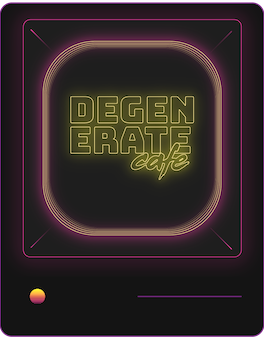

## Hi there 👋, I'm Nick, a dApp developer.

I'm currently building an Ethereum data-analytics platform, [Degenerate Cafe](https://github.com/nickbtts/degenerate-cafe), using React, GraphQL and Javascript, whilst learning about [Web3JS](https://web3js.readthedocs.io/en/v1.3.4/). I also like to contribute to open source decentralised projects, such as [BuildDAO](https://build.finance).

I'm also...

- Ξ Helping out in the blockchain world, with a focus on anything Ethereum-based.
- 🛩 Previously a [private jet](https://www.gulfstream.com) and military pilot.
- 🎹 An [electronic music producer](https://www.soundcloud.com/rabotamusic) and DJ. 

### My Languages and tools

<code></code>
<code></code>
<code></code>
<code></code>
<code></code>
<code></code>
